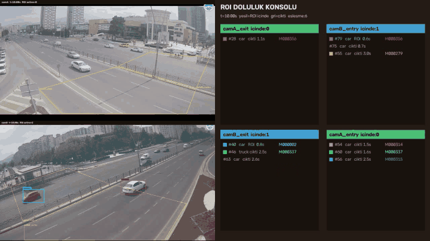
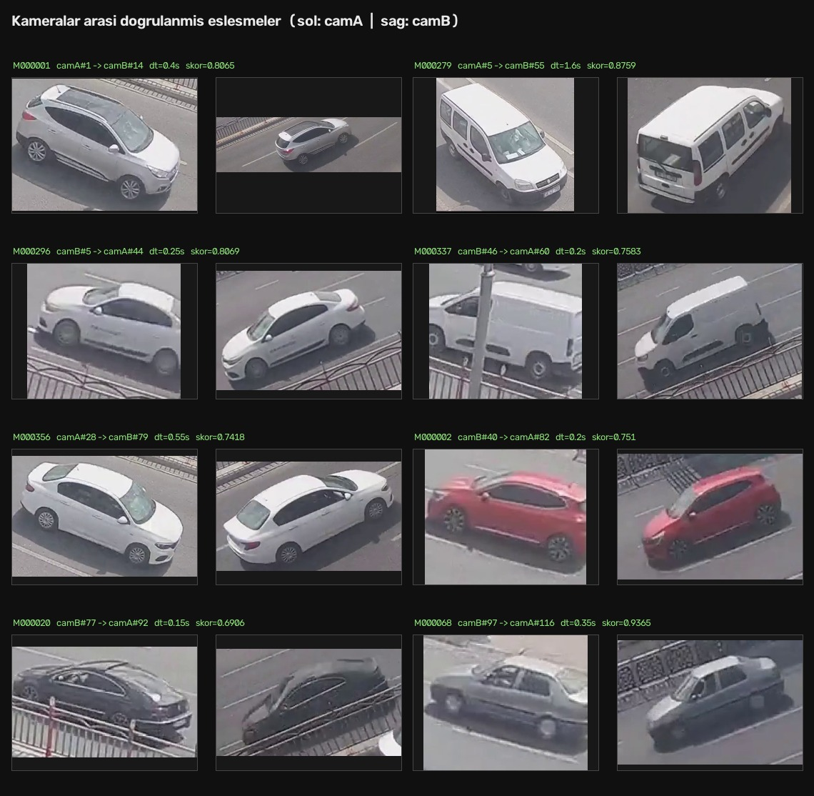
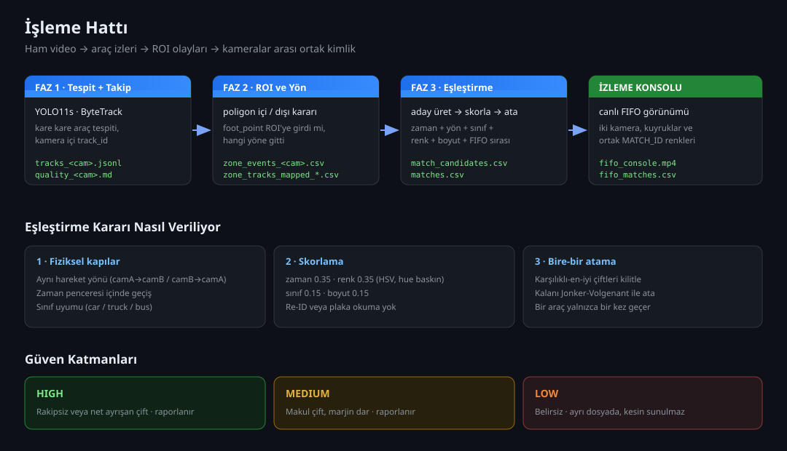
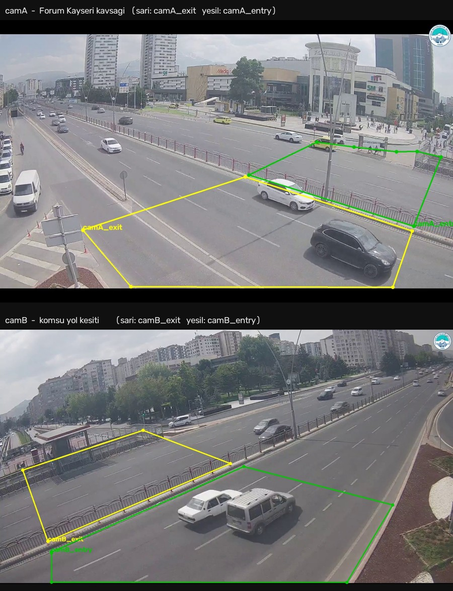

<div align="center">

# MCMOT_Pro

### Çoklu Kamera Araç Takibi — Kameralar Arası Kimlik Sürekliliği

Birbirini takip eden iki trafik kamerasında araçları tespit eder, her kamerada ayrı ayrı takip eder ve
bir kameradan çıkan aracın diğerine girişini **skorlanmış olasılıksal eşleştirme** ile ilişkilendirir.

**Plaka okuma yok · Re-ID yok · Görünüm embedding'i yok.**
Karar yalnızca zaman, hareket yönü, ROI geçişi ve ucuz görünüm ipuçlarıyla verilir.

<br>


<br>



<sub>İzleme konsolu — sol tarafta iki kamera akışı, sağda ROI doluluk panelleri ve ortak MATCH_ID renkleri.
Aynı araç her iki kamerada da aynı renkle çerçevelenir.</sub>

</div>

---

## Sonuçlar

Doğrulama seti, iki kamera arasında gözle işaretlenmiş **37 gerçek geçiş çiftinden** oluşur.
Aşağıdaki ölçüm `scripts/03_eval_matches.py` çıktısıdır ve insan onaylı satırlar
kesinlik hesabının dışında tutulur.

<div align="center">

| Katman | Eşleşme | Doğru | Kesinlik |
|:--|--:|--:|--:|
| **HIGH** | 16 | 16 | **%100** |
| **MEDIUM** | 2 | 2 | **%100** |
| **Raporlanan (high + medium)** | **18** | **18** | **%100** |
| LOW (ayrı dosyada, kesin sunulmaz) | 11 | 10 | %91 |

</div>

| Kapsama | Değer |
|:--|--:|
| Otomatik hat herhangi bir katmanda bulmuş | 28 / 37 = **%75** |
| Otomatik hat raporlamış (high + medium) | 18 / 37 = **%48** |

Ham çıktı: [`docs/sonuclar/dogrulama-ciktisi.txt`](docs/sonuclar/dogrulama-ciktisi.txt) ·
Doğrulama seti: [`docs/sonuclar/ground_truth.csv`](docs/sonuclar/ground_truth.csv)

> Tasarım tercihi: sistem **kesin kimlik** iddia etmez. Emin olduğu yerde eşleştirir,
> emin olmadığı yeri `matches_ambiguous.csv` içinde belirsiz olarak raporlar.

---

## Eşleştirme Kanıtı

Doğrulama setinde onaylanmış eşleşmelerden bir kesit — solda `camA`, sağda `camB`,
aynı fiziksel araç:



---

## Nasıl Çalışıyor



### Faz 1 — Tespit ve tek kamera takibi

YOLO11s her kareyi tarar, ByteTrack araçlara kamera içi `track_id` verir.
Her tespit veri kontratına uygun bir JSONL satırına yazılır: zaman damgası, sınıf,
bbox, aracın yere bastığı nokta (`foot_point`) ve ucuz görünüm ipuçları
(baskın renk, boyut sınıfı, en–boy oranı).

Yoğun trafikte kapanma yaşandığında araç kimliğini kaybeder ve yeniden göründüğünde
yeni bir kimlik alır. `01b_stitch_tracks.py` bu parçaları hareket tahmini ve zaman
yakınlığıyla birleştirir — burada da görünüm modeli kullanılmaz.

### Faz 2 — ROI olayları ve fiziksel yön

Her kamera için giriş ve çıkış bölgeleri poligon olarak tanımlanır. Aracın
`foot_point` noktası poligona girdiğinde ve çıktığında olay üretilir; ROI içindeki
yer değiştirme fiziksel hareket etiketine çevrilir (`camA_to_camB` / `camB_to_camA`).
Kısa, duran veya gürültülü izler `other` etiketiyle elenir.



### Faz 3 — Kameralar arası eşleştirme

Aday çiftler aynı yönde ve zaman penceresi içinde olmalıdır. Her aday şu ağırlıklarla
skorlanır: **zaman 0.35 · renk 0.35 · sınıf 0.15 · boyut 0.15.** Renk benzerliği HSV
uzayında hue baskın hesaplanır; iki kamera farklı ışık ve açıdan baktığı için parlaklık
ve doygunluk düşük ağırlık taşır.

Seçim iki aşamalıdır: önce **karşılıklı-en-iyi** çiftler kilitlenir (en güçlü eşleşme
toplam skor uğruna feda edilmesin diye), kalan adaylar **Jonker–Volgenant** ile bire-bir
atanır. Bir araç yalnızca bir kez geçer.

### Kalibrasyonda öğrenilen kural

Doğrulama seti üzerinde şu ayrım keskin çıktı: aracın ROI içinde kat ettiği mesafe
kısaysa çıkış damgası gerçek geçiş çizgisine varılmadan basılıyor ve araç hedefe
geç ulaşıyor.

| ROI içi mesafe | Gözlenen geçiş süresi | Örnek |
|:--|:--|--:|
| < 620 px | 0.90 – 2.05 sn | 6 çift |
| ≥ 620 px | 0.10 – 0.55 sn | 31 çift |

İki dağılım örtüşmediği için pencere herkese değil **yalnızca kısa mesafeli kaynaklara**
açılır (`configs/matching.yaml` → `conditional_window`). Pencereyi global genişletmek
denenmiş ve başarısız olmuştu: artan belirsizlik mevcut doğru eşleşmeleri bozuyordu.

---

## Kurulum

```bash
git clone https://github.com/atlykara/MCMOT_Pro.git
cd MCMOT_Pro

python -m venv .venv
source .venv/bin/activate            # Windows: .venv\Scripts\activate
python -m pip install --upgrade pip
python -m pip install torch torchvision     # CUDA sürümü için pytorch.org
python -m pip install -r requirements.txt
```

Model ağırlıkları ve video verileri depoya dahil değildir. `models/` altına YOLO11
ağırlıklarını, `data/cams/` altına 20 FPS'e standardize edilmiş kamera kayıtlarını
yerleştirin:

```
data/cams/camA_20fps.mp4
data/cams/camB_20fps.mp4
models/yolo11s.pt
```

## Çalıştırma

```bash
export PYTHONPATH=src

# Faz 1 — tespit + takip
python scripts/01_run_detect_track.py --camera camA --model models/yolo11s.pt --conf 0.25 --imgsz 960
python scripts/01_run_detect_track.py --camera camB --model models/yolo11s.pt --conf 0.25 --imgsz 960

# Faz 2 — ROI ve yön
python scripts/02_assign_zones.py --camera camA
python scripts/02_summarize_zone_tracks.py --camera camA
python scripts/02_apply_direction_mapping.py --camera camA     # camB için de tekrarlayın

# Faz 3 — eşleştirme ve ölçüm
python scripts/03_extract_track_features.py --camera camA
python scripts/03_extract_track_features.py --camera camB
python scripts/03_build_match_candidates.py
python scripts/03_assign_matches.py
python scripts/03_eval_matches.py

# İzleme konsolu
python scripts/03_run_fifo_console.py --duration 30 --show
```

Adım adım anlatım ve kalibrasyon notları:
[`docs/calistirma-rehberi.md`](docs/calistirma-rehberi.md)

### Konsol kontrolleri

| Tuş | İşlev |
|:--|:--|
| `Space` | Oynat / duraklat |
| `←` `→` veya `J` `L` | 1 saniye geri / ileri |
| `[` `]` | 5 saniye geri / ileri |
| `R` | Başa dön |
| `Q` / `Esc` | Kapat |

Geri veya ileri sarıldığında FIFO kuyrukları hedef zamana kadar yeniden oynatılır,
böylece konsol ile video senkron kalır.

---

## Depo Yapısı

```
MCMOT_Pro/
├── src/mcmot/                 Çekirdek kütüphane
│   ├── detect_track.py          YOLO + ByteTrack tespit/takip
│   ├── zones.py                 Poligon geometrisi, nokta-içinde-mi
│   ├── fifo_matcher.py          Yön bazlı zaman kontrollü FIFO eşleştirici
│   └── io_utils.py              JSONL veri kontratı
│
├── scripts/                   Faz numarasına göre çalıştırılabilir adımlar
│   ├── 00_*                     Veri hazırlama
│   ├── 01_*, 01b_*              Tespit, takip, kalite, iz dikişleme
│   ├── 01c_* – 01e_*            Model kıyaslama, etiketleme, fine-tuning
│   ├── 02_*                     ROI tanımı, zone olayları, yön eşleme
│   └── 03_*                     Aday üretimi, atama, ölçüm, izleme konsolu
│
├── configs/                   Kod değil, ayar
│   ├── cameras.yaml             Kamera kimlikleri, video yolları, FPS
│   ├── zones_cam*.yaml          ROI poligonları
│   ├── direction_mapping.yaml   Görüntü yönü → fiziksel hareket
│   ├── matching.yaml            Zaman penceresi, skor eşikleri
│   └── bytetrack_*.yaml         Takip parametreleri
│
├── docs/                      Raporlar, rehberler, ölçüm çıktıları
├── tests/                     Veri kontratı ve eşleştirme testleri
├── data/                      Videolar ve etiketleme veri kümesi (depoda yok)
├── models/                    YOLO ağırlıkları (depoda yok)
└── outputs/                   Üretilen çıktılar (depoda yok)
```

## Testler

```bash
PYTHONPATH=src python -m pytest -q
```

Testler veri kontratını (`tracks_<cam>.jsonl` alan şeması, kare sırası), FIFO
eşleştiricinin kuyruk davranışını ve zaman penceresi kapılarını doğrular.

---

## Araç Sınıfı Modeli

Genel COCO ağırlıkları `car`, `bus`, `truck` gibi kaba sınıfları bilir; panelvan,
minibüs, pikap ve özel araçları ayrı hedefler olarak öğrenmemiştir. Depo, saha
görüntüleriyle fine-tuning için Label Studio tabanlı bir **aktif öğrenme döngüsü**
içerir: insan onaylı etiketler sürümlenir, bir ara model eğitilir, bu model kalan
karelere ön-tahmin üretir ve döngü tekrarlanır.

| Ölçüt | YOLO11s | YOLO26n |
|:--|--:|--:|
| COCO mAP50-95 | **47.0** | 40.9 |
| Yerel işleme hızı (CPU, 960 px) | 4.42 FPS | **9.22 FPS** |
| Yerel tespit / kare | **9.56** | 6.81 |

Doğruluk önceliğiyle `YOLO11s` seçildi. Ayrıntı:
[`docs/model-secimi-ve-fine-tuning.md`](docs/model-secimi-ve-fine-tuning.md)

---

## Bilinen Sınırlamalar

- **Doğrulama seti track kimlik uzayına bağlıdır.** Faz 1 yeniden çalıştırıldığında
  ByteTrack farklı kimlikler atar ve ölçüm geçersizleşir. Ölçüm yapılacaksa Faz 1
  çıktısı korunmalı, yalnızca Faz 2–3 yeniden çalıştırılmalıdır.
- **ROI sınırındaki araçlar.** Eğik kamera açısı ve `foot_point` yaklaşımı nedeniyle
  şerit sınırına çok yakın araçlar zaman zaman yanlış bölgeye düşebilir. Bu yüzden
  Faz 3 yalnızca ROI bilgisine güvenmez; zaman, yön, sınıf ve görünüm birlikte kullanılır.
- **Kamera saatleri senkron varsayılır.** Kayma varsa `configs/matching.yaml`
  içindeki `clock_offset_s` ile düzeltilir.
- **Örtüşmeyen görüş alanları.** İki kamera aynı sahneyi görmez; birbirini takip eden
  yol kesitlerini görür. Bu nedenle eşleştirme geometrik değil, zamansal handoff mantığındadır.

## Yol Haritası

- [x] Faz 1 — tespit, tek kamera takibi, kalite raporlama
- [x] Faz 1.5 — kapanma sonrası iz dikişleme
- [x] Faz 2 — ROI olayları ve fiziksel yön atama
- [x] Faz 3 — kameralar arası skorlu eşleştirme ve izleme konsolu
- [x] Saha görüntüleriyle fine-tuning için aktif öğrenme döngüsü
- [ ] İkiden fazla kameraya genişletme
- [ ] Canlı kamera akışı ve mesaj kuyruğu entegrasyonu
